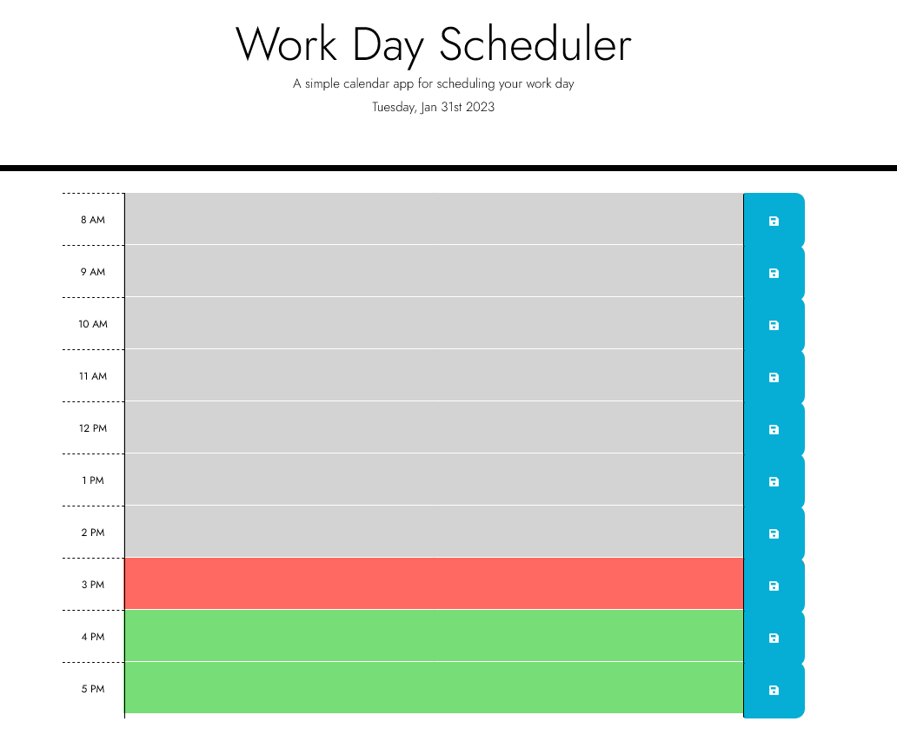

# Daily-Planner-App

## Description
I create an application uses jQuery, bootstrap, and moment.js that allows a user to save events for each hour of the day. It runs in the browser and feature dynamically updated HTML and CSS powered by jQuery.

## Usage

This workday application display work hours of the day 8AM - 5PM. Each time block has an input field and save button where users can store their schedule. So, you can click on the textarea of the time block you want and type in your schedule text for the hour. When you are done, click the save icon and everything you typed for the time block will store in their local storage.

## Screenshot

## License
 
MIT License

## Contributor:
Lentio Sechou ©2023 All Rights Reserved.
